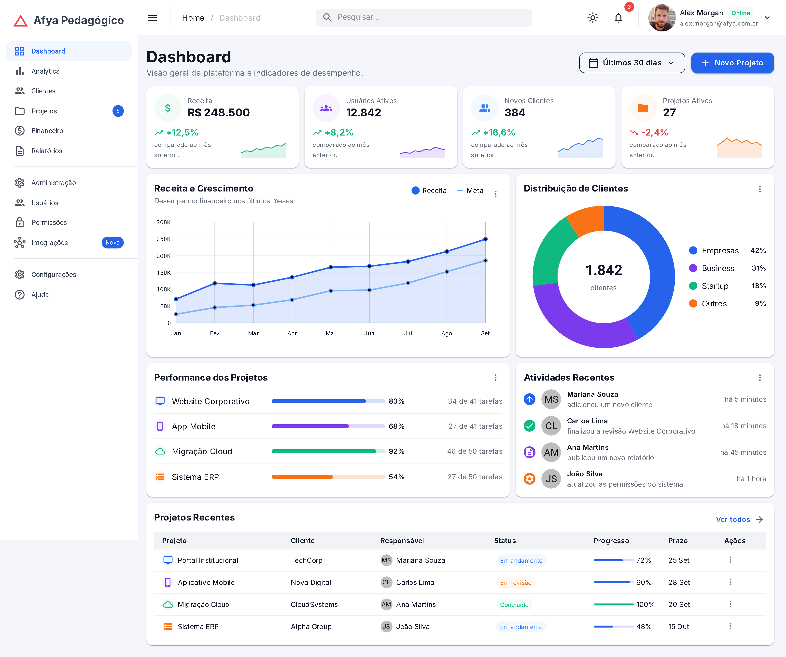
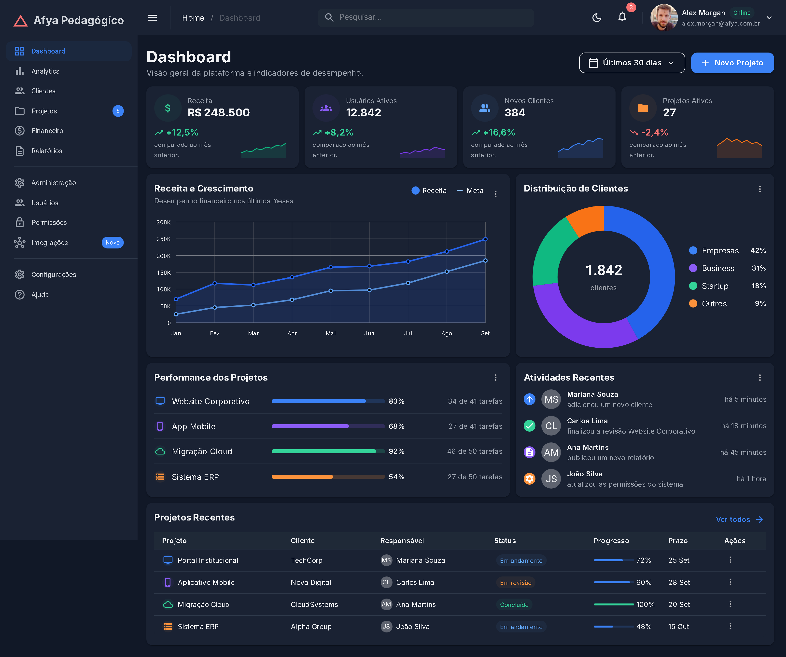
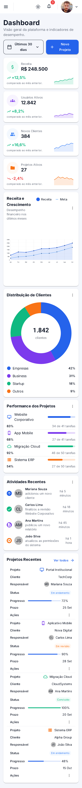
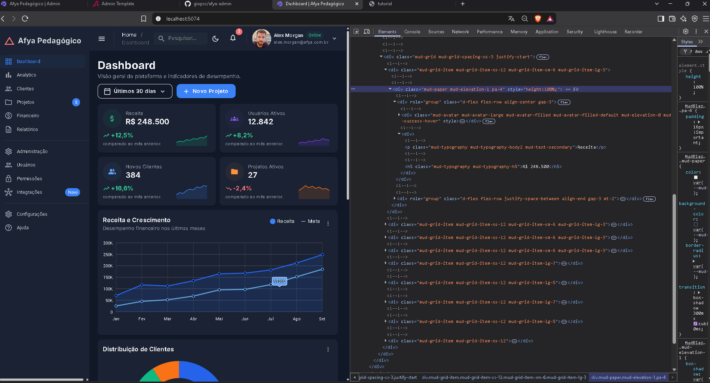

# Afya Admin — Dashboard com Blazor WebAssembly e MudBlazor

## Identificação

| | |
|---|---|
| **Aluno(a)** | Giovanna Secundo Penso |
| **Matrícula** | 0035674 |
| **Faculdade** | São Lucas Afya |
| **Curso** | Ciência da Computação |
| **Disciplina** | Programação para Sistemas Web |
| **Professor(a)** | Lilo |
| **Semestre** | 2026.2 |

## Objetivo do projeto

`PREENCHER — 2 a 4 parágrafos`

## Tecnologias utilizadas

- .NET 10 / Blazor WebAssembly autônomo (standalone)
- MudBlazor 9 (componentes, tema e classes utilitárias)
- Template `mudblazorwasm` (pacote `MudBlazor.Templates`)
- Fonte Inter (Google Fonts)
- Git / GitHub

## Como executar

Pré-requisito: **.NET SDK 10** (verifique com `dotnet --version`, deve começar com `10.`).

Na primeira vez, instale os templates do MudBlazor:

```bash
dotnet new install MudBlazor.Templates
```

Depois, clone e execute:

```bash
git clone https://github.com/giopsx/afya-admin.git
cd afya-admin
dotnet watch
```

A aplicação abre em `http://localhost:5074` (a porta está em `Properties/launchSettings.json`).

## Telas

### Tema claro


### Tema escuro


### Versão mobile


No celular os KPIs ficam em uma coluna, o sidebar vira gaveta, a busca e o bloco de nome/e-mail
do usuário são ocultados, e a tabela de Projetos Recentes deixa de ser tabela e vira uma lista de
cards, com cada célula rotulada pelo `DataLabel`.

### HTML gerado (DevTools)


`PREENCHER — qual componente foi inspecionado, qual HTML ele gerou e quais classes apareceram`

## Estrutura do projeto

```
afya-admin/
├── Components/                        componentes visuais reutilizáveis do dashboard
│   ├── AtividadesRecentes.razor
│   ├── CabecalhoPagina.razor
│   ├── DashboardCard.razor
│   ├── GraficoDistribuicaoClientes.razor
│   ├── GraficoReceita.razor
│   ├── KpiCard.razor
│   ├── PerformanceProjetos.razor
│   ├── ProjetosRecentes.razor
│   ├── SeletorPeriodo.razor
│   └── Ui.cs                          funções auxiliares de apresentação
├── Data/
│   └── DashboardData.cs               modelos (records) e dados fictícios
├── Layout/
│   ├── MainLayout.razor               moldura da aplicação: tema, AppBar e sidebar
│   └── NavMenu.razor                  links do menu lateral
├── Pages/
│   ├── Dashboard.razor                página "/" — só monta os componentes
│   └── NotFound.razor                 página 404
├── Properties/
│   └── launchSettings.json            perfis de execução e porta
├── wwwroot/                           arquivos estáticos servidos ao navegador
│   ├── css/app.css                    CSS do template (não modificado)
│   ├── img/alex-morgan.jpg            foto fictícia do usuário
│   └── index.html                     a única página HTML real da aplicação
├── docs/
│   ├── html-gerado.md                 HTML gerado pelos componentes
│   └── prints/                        imagens usadas neste README
├── App.razor                          roteador
├── Program.cs                         ponto de entrada
├── _Imports.razor                     @using globais
└── afya-admin.csproj                  definição do projeto
```

| Pasta | Papel |
|---|---|
| `Components` | componentes de apresentação reutilizáveis; recebem tudo por parâmetro |
| `Data` | os dados fictícios e os `record` que os descrevem, separados da apresentação |
| `Layout` | a moldura comum a todas as páginas: tema, barra superior e menu lateral |
| `Pages` | os componentes roteáveis (`@page`), ou seja, as telas da aplicação |
| `wwwroot` | arquivos estáticos servidos a partir da raiz do site |

## Componentes criados

| Componente | Responsabilidade | Parâmetros que recebe |
|---|---|---|
| `CabecalhoPagina` | título e subtítulo da página, com área livre para botões à direita | `Titulo` (obrigatório), `Subtitulo`, `Acoes` (`RenderFragment`) |
| `SeletorPeriodo` | menu com cara de botão para escolher o período | `Opcoes` (obrigatório), `Valor`, `ValorChanged` (habilita `@bind-Valor`) |
| `DashboardCard` | card base reutilizado por 5 blocos: título, subtítulo, ações, menu "⋮" e conteúdo | `Titulo` (obrigatório), `Subtitulo`, `Acoes`, `Menu`, `ChildContent` |
| `KpiCard` | um indicador: ícone pastel, valor, variação e mini gráfico de tendência | `Kpi` (obrigatório, record `Kpi`) |
| `GraficoReceita` | gráfico de linha Receita × Meta, com legenda própria | `Meses`, `Receita`, `Meta` (todos obrigatórios) |
| `GraficoDistribuicaoClientes` | gráfico de rosca com o total no centro e legenda com percentuais | `Total`, `Segmentos` (ambos obrigatórios) |
| `PerformanceProjetos` | lista de projetos com barra de progresso e contagem de tarefas | `Projetos` (obrigatório) |
| `AtividadesRecentes` | feed de atividades com ícone da ação e avatar de iniciais | `Atividades` (obrigatório) |
| `ProjetosRecentes` | tabela de projetos, que vira lista de cards no celular | `Projetos` (obrigatório) |
| `Ui` (classe estática) | `FundoSuave(Color)` monta a classe `mud-{cor}-hover`; `Iniciais(nome)` devolve "MS" | — |

## O que aprendi

**1. Como uma aplicação Blazor WebAssembly inicia no navegador? Qual é o papel do `index.html`, da `<div id="app">` e do `Program.cs`?**

A aplicação Blazor WASM começa a rodar quando o navegador carrega o **index.html**, que fica na pasta `wwwroot/` e é o único arquivo HTML real de todo o projeto. Inclusive, mexi nele para trocar o `<title>` para "Afya Pedagógico | Admin", puxar a fonte Inter e tirar aquele `<link>` do `afya-admin.styles.css`. É esse HTML que chama o `blazor.webassembly.js`, responsável por baixar o runtime do .NET e as DLLs da aplicação para rodar direto no browser.

Durante o carregamento, fica tudo dentro da **`<div id="app">`**. Acompanhei isso de perto pelo DevTools: no começo, essa div fica só com a minha animação de loading na tela.

Assim que o runtime .NET inicializa, ele executa o **Program.cs**. É lá que a linha `builder.RootComponents.Add<App>("#app")` conecta a raiz do C# com a tag do HTML. Um detalhe importante é que, logo acima dessa linha, chamei o `builder.Services.AddMudServices()` — sem essa configuração do MudBlazor, os `MudMenu` do meu menu de notificações e do seletor de período nem abriam.

Com o C# no comando, o roteador do **App.razor** lê a URL atual para decidir qual página renderizar. Como estou entrando na rota principal, ele cai no meu `Pages/Dashboard.razor`, por conta da diretiva `@page "/"`. Nesse momento, a animação de loading dentro da `<div id="app">` some e o layout completo do painel é renderizado na tela.

**2. Qual é a diferença entre um Layout, uma Page e um Component neste projeto? Dê um exemplo de cada.**

No meu projeto, a diferença entre eles está basicamente na responsabilidade e no papel que cada um desempenha na construção da interface.

O **Layout** funciona como a moldura padrão que aparece em todas as telas — é ele que segura a AppBar, o sidebar e as configurações de tema do sistema. No meu código, isso fica no `Layout/MainLayout.razor`. Para que o Blazor entenda que esse arquivo é um layout, ele precisa ter a diretiva `@inherits LayoutComponentBase` no topo. Além disso, ele obrigatoriamente usa o `@Body` em algum lugar do HTML, que é exatamente o "buraco" onde o conteúdo de cada tela será injetado.

A **Page** (página) é a tela em si, o conteúdo que responde a uma URL específica do navegador. O melhor exemplo é a minha `Pages/Dashboard.razor`. Ela se torna uma página porque carrega a diretiva de rota no topo, como `@page "/"`. Quando o usuário acessa essa URL principal, o roteador que fica lá no `App.razor` identifica o caminho, escolhe o Dashboard e o renderiza dentro do `@Body` do `MainLayout`.

Já o **Component** é uma peça de interface reutilizável que não responde a nenhuma URL. Qualquer arquivo que eu crio na pasta `Components/`, como o `KpiCard.razor`, entra nessa categoria. Ele não tem diretiva de rota (`@page`). Em vez de ser acessado por um link, ele é "chamado" por outros arquivos como se fosse uma tag HTML, tipo `<KpiCard Kpi="kpi"/>`, e recebe os dados de fora através de propriedades marcadas com o atributo `[Parameter]`.

No fim das contas, os três são componentes Razor (arquivos `.razor`). A estrutura e a tecnologia por trás deles são idênticas. O que muda é apenas o papel que assumem: quem ganha um `@page` vira página, quem herda o `LayoutComponentBase` e renderiza um `@Body` vira layout, e o resto funciona como peças reutilizáveis desse quebra-cabeça.

**3. O que é um `RenderFragment` e como o `DashboardCard` usa esse recurso para ser reutilizado por vários cards?**

O `RenderFragment` é o coração da componentização do meu projeto. Diferente de um parâmetro comum que recebe um valor como uma `string` ou um `int`, ele recebe marcação (tags HTML e outros componentes). Basicamente, ele funciona como um "buraco" ou slot que eu deixo na estrutura para que quem for usar o componente preencha com o conteúdo que quiser.

No meu arquivo `Components/DashboardCard.razor`, eu declarei três parâmetros desse tipo como opcionais (`RenderFragment?`): `Acoes`, `Menu` e `ChildContent`.

O `ChildContent` tem um nome especial e mágico no Blazor: qualquer coisa que eu colocar solta entre as tags de abrir e fechar do meu componente (quando não nomeio nenhum slot) cai automaticamente nele. Já para os outros dois, eu preciso chamar as tags pelo nome na hora de usar.

Dá para ver como isso funciona na prática olhando quem preenche esses slots:

- No `GraficoReceita.razor`, eu preencho os três: a legenda de Receita/Meta vai dentro da tag `<Acoes>`, os dois itens de opção vão dentro de `<Menu>`, e o gráfico em si fica no `<ChildContent>`.
- Já no `GraficoDistribuicaoClientes.razor`, eu preencho apenas dois, já que ele não precisa do `<Acoes>`.

Uma sacada muito útil na montagem do layout do card foi usar a verificação `@if (Menu is not null)`. Isso faz com que o botão de opções (aquele "⋮" com os três pontinhos) só exista na tela se eu realmente tiver passado algum item para esse slot. É exatamente por isso que nem todo card do meu dashboard tem os três pontinhos.

O grande resultado de estruturar o código dessa forma é que 5 blocos do meu dashboard usam exatamente o mesmo card base. Eu não precisei repetir a marcação visual do `MudPaper` e todo o seu estilo cinco vezes. Eu crio a "casca" apenas uma vez e injeto o recheio dinamicamente.

**4. Como funciona o `@bind-Valor` no `SeletorPeriodo`? Qual é o papel do `ValorChanged`?**

No Blazor, existe uma convenção muito prática: se eu crio em um componente um parâmetro chamado `X` e um `EventCallback<T>` chamado `XChanged`, quem for usar esse componente ganha o direito de usar a sintaxe de via de mão dupla `@bind-X`. Como no meu `SeletorPeriodo` eu declarei o parâmetro `Valor` e o evento `ValorChanged`, lá no meu `Dashboard.razor` eu consigo amarrar tudo escrevendo simplesmente `@bind-Valor="_periodo"`.

O ponto central de como isso funciona no meu código é que o `SeletorPeriodo` não altera o próprio `Valor` por conta própria. Quando eu clico em uma nova opção de data, ele apenas avisa quem o chamou disparando um `ValorChanged.InvokeAsync(opcao)`.

Quem é o verdadeiro dono do estado é a página (`Dashboard.razor`). Quando ela recebe esse aviso do componente, ela atualiza o seu próprio campo `_periodo`, sofre uma re-renderização e, então, passa esse novo `Valor` de volta para baixo, para dentro do `SeletorPeriodo`. É por causa dessa atualização descendo da página que o rótulo do botão finalmente muda na interface. Testei isso na prática: ao clicar em "Últimos 7 dias", o texto do botão mudou na hora.

No fim das contas, isso ilustra perfeitamente o princípio do fluxo de dados em uma direção só: o dado sempre **desce** através do parâmetro, e o evento sempre **sobe** através do callback.

**5. Por que os dados ficam na pasta `Data`, separados dos componentes? Que vantagem isso traz se, no futuro, os dados vierem de uma API?**

Eu deixei os dados na pasta `Data`, totalmente separados dos meus componentes, de propósito. Se você abrir o meu `Data/DashboardData.cs`, vai notar que ele só guarda os `record` (`Kpi`, `SegmentoCliente`, `ProjetoRecente`...) e as listas estáticas com os dados falsos.

A mágica acontece porque os meus componentes não leem o `DashboardData` diretamente. O meu `ProjetosRecentes.razor`, por exemplo, só pede uma `IReadOnlyList<ProjetoRecente>` via parâmetro, enquanto o `GraficoReceita.razor` espera receber um simples `double[]`. Quem faz a ponte e liga as duas pontas é a página.

A consequência prática de fazer isso é fantástica: no futuro, quando eu for trocar esses dados fake por uma API real, eu só vou precisar mexer na origem da informação — ou seja, na própria página ou em um serviço de busca. Nenhum dos meus componentes vai sofrer qualquer alteração, porque eles continuam recebendo exatamente a mesma "forma" de dado, não importa de onde a informação venha.

Esse é inclusive o caminho sugerido pelo desafio 5 do tutorial: criar uma interface `IDashboardService`, buscar os dados nela e puxar para a tela usando a diretiva `@inject`.

No fim das contas, a regra de ouro do meu código fica muito clara: o `Data` responde **"o quê"** mostrar, enquanto os `Components` respondem **"como"** mostrar.

**6. Como o `MudGrid` com `xs`, `sm` e `lg` faz os cards de KPI se reorganizarem em telas de tamanhos diferentes?**

O sistema de grid do MudBlazor divide a largura total da tela em exatas 12 colunas, e no meu `Dashboard.razor` eu aproveitei essa estrutura para deixar o layout totalmente responsivo usando `<MudItem xs="12" sm="6" lg="3">` nos cards de KPI. A regra desse grid é simples: o valor definido vale daquele tamanho de tela para cima, até ser sobrescrito pelo breakpoint seguinte.

Na prática, o `xs="12"` faz com que em telas pequenas, abaixo de 600px, o card ocupe as 12 colunas inteiras, ficando um card por linha. Quando a tela atinge 600px, o `sm="6"` entra em ação ocupando 6 colunas, o que exibe dois cards por linha. Já em telas grandes acima de 1280px, o `lg="3"` assume o controle ocupando 3 colunas, encaixando os quatro KPIs lado a lado na mesma linha.

A maior prova de que essa lógica está funcionando perfeitamente no meu projeto é o print `mobile.png`, que mostra os quatro KPIs empilhados em coluna única no celular. Além dos KPIs, apliquei essa mesma matemática no resto do painel: os blocos dos gráficos usam `lg="7"` e `lg="5"`, somando as 12 colunas para dividir a tela proporcionalmente, enquanto a tabela usa `xs="12"` para garantir que sempre ocupe a largura inteira disponível em qualquer dispositivo.

**7. Como foi possível estilizar a página inteira sem escrever CSS? Explique o papel do tema (`MudTheme`) e das classes utilitárias.**

No meu projeto, eu consegui estilizar toda a interface sem escrever nenhuma linha de CSS próprio, usando três ferramentas principais do MudBlazor. A primeira delas são os **parâmetros diretos nos componentes**. Em vez de criar classes no CSS, eu passo as propriedades direto nas tags do Blazor, utilizando atributos como `Elevation="1"`, `Variant="Variant.Filled"`, `Color="Color.Primary"` e `Size="Size.Large"`. Só isso já resolve grande parte do visual, do tamanho e do comportamento dos botões, cards e inputs.

A segunda ferramenta é a centralização do design através do **MudTheme**, que configurei lá no meu `MainLayout.razor`. Nele, eu defini o `PaletteLight`, o `PaletteDark`, os `LayoutProperties` (como `DefaultBorderRadius = "12px"` e `AppbarHeight = "72px"`) e a `Typography` (puxando a fonte Inter, deixando os títulos com peso 700 e tirando a caixa alta automática dos botões). O que acontece por baixo dos panos é que o MudBlazor transforma tudo isso em variáveis CSS genéricas (como `--mud-palette-primary`) que todos os componentes leem. É exatamente por causa dessa arquitetura centralizada que alternar o valor de `IsDarkMode` muda a aplicação inteira de uma só vez, me entregando o tema escuro praticamente de graça.

Por fim, a terceira ferramenta são as **classes utilitárias** que já vêm embutidas no `MudBlazor.min.css`. Eu estruturei quase todo o layout usando classes prontas como `pa-4`, `d-flex`, `flex-grow-1`, `mud-text-secondary`, `mud-background-gray` e `border-b`. A prova mais forte de como isso funciona na prática está no meu print do DevTools: o `Class="pa-4"` que eu escrevi lá no código do meu `KpiCard.razor` aparece intacto na tag HTML final renderizada no navegador, e a aba Styles mostra exatamente a regra `.pa-4 { padding: 16px !important }` sendo aplicada pelo framework.

**8. Por que o namespace do projeto é `afya_admin` e não `afya-admin`?**

A razão pela qual o código usa `afya_admin` em vez de `afya-admin` está nas regras da própria linguagem C#. O hífen não é um caractere válido para nomes de identificadores, porque o compilador leria isso como uma operação matemática de subtração: "afya menos admin".

Para resolver isso, o SDK do .NET tem um comportamento padrão bem inteligente: ele usa o nome do projeto para definir o namespace raiz, mas substitui automaticamente qualquer caractere inválido por um underscore (`_`).

É exatamente por isso que a pasta do meu projeto e o arquivo de configuração mantêm o hífen original, chamando-se `afya-admin.csproj`. Porém, dentro do código fonte, o namespace gerado precisa respeitar as regras do C#. Isso fica claro na prática quando olho o meu `Program.cs`, que tem a declaração `using afya_admin;`, ou o meu arquivo `_Imports.razor`, onde fiz a importação global das peças da interface com `@using afya_admin.Components`.

## Dificuldades e soluções

`PREENCHER — pelo menos dois problemas e como foram resolvidos`

## Melhorias futuras (opcional)

`PREENCHER (opcional)`
